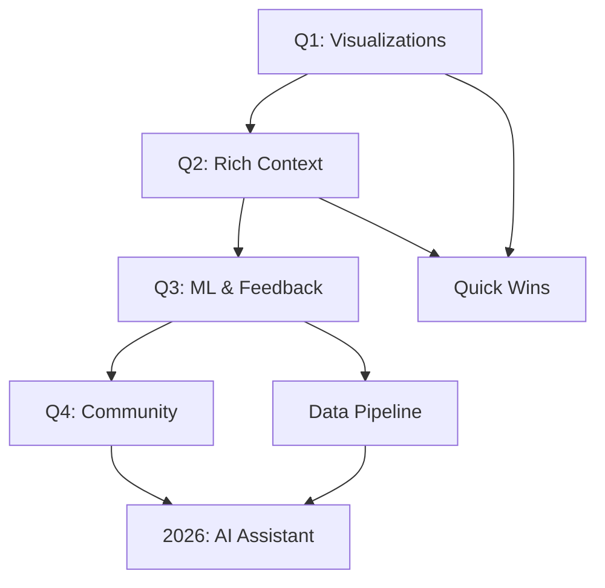

# 🗺️ **Roadmap: Decision Wizard Evolution**

## 🎯 **Visão 2025: O Melhor Assistente de Decisão Arquitetural**

O Decision Wizard está evoluindo de uma ferramenta educacional (7/10) para o assistente definitivo de decisões arquiteturais (10/10), considerando contexto real, dados históricos e aprendizado contínuo.

---

## 📈 **Q1 2025: Visualizações e Comparações**

### **🎨 Epic 1: Visual Decision Support**

**Objetivo:** Tornar trade-offs e comparações visuais e claras  
**Owner:** Frontend Team  
**ADR:** [001-visualizations-and-comparisons.md](./docs/adr/001-visualizations-and-comparisons.md)

#### **Sprint 1-2: Foundation (2 semanas)**

- ✅ Setup Recharts + Mantine integration
- ✅ RadarChart component com dados estáticos
- ✅ Responsive design mobile/desktop
- ✅ Dark/light theme support
- **Deliverable:** RadarChart funcional

#### **Sprint 3-4: Core Visualizations (2 semanas)**

- ✅ Trade-offs Matrix interativa
- ✅ Implementation Timeline visual
- ✅ Integration com recommendations engine
- ✅ Unit tests completos
- **Deliverable:** 3 visualizações principais

#### **Sprint 5-6: Advanced Features (2 semanas)**

- ✅ ROI Estimation charts
- ✅ Pattern comparison side-by-side
- ✅ Export/share functionality
- ✅ A/B testing setup
- **Deliverable:** Feature completa e testada

**🎯 Meta Q1:** Decision Wizard 10/10 funcional com feedback visual

---

## 🚀 **Q2 2025: Contexto Rico e Personalização**

### **🧠 Epic 2: Intelligent Context**

**Objetivo:** Capturar contexto ainda mais específico para recomendações precisas  
**Owner:** Product + Engineering Teams

#### **Sprint 7-8: Business Context (2 semanas)**

- ✅ Budget/Timeline constraints (3 novas perguntas)
- ✅ Industry-specific considerations (Healthcare, Fintech, etc.)
- ✅ Compliance requirements (LGPD, SOX, HIPAA)
- ✅ Updated scoring algorithm
- **Deliverable:** Wizard com 8 perguntas contextuais

#### **Sprint 9-10: Technical Context (2 semanas)**

- ✅ Current stack analysis ("Já usam React?")
- ✅ Legacy system constraints
- ✅ Performance requirements específicos (usuários simultâneos, latência)
- ✅ Infrastructure preferences (Cloud, On-premise, Hybrid)
- **Deliverable:** Stack-aware recommendations

#### **Sprint 11-12: Team Context (2 semanas)**

- ✅ Skills assessment ("Time conhece Docker?")
- ✅ Company culture mapping (Move fast vs Governance)
- ✅ Remote/hybrid team considerations
- ✅ Previous architecture experience
- **Deliverable:** People-aware recommendations

**🎯 Meta Q2:** 15+ fatores contextuais considerados

---

## 🔄 **Q3 2025: Feedback Loop e ML**

### **📊 Epic 3: Continuous Learning**

**Objetivo:** Aprender com uso real para melhorar recomendações  
**Owner:** Data + Engineering Teams

#### **Sprint 13-14: Feedback System (2 semanas)**

- ✅ "Foi útil?" rating system integrado
- ✅ Follow-up surveys automáticos (3, 6, 12 meses)
- ✅ Success/failure case tracking
- ✅ Anonymous analytics com GDPR compliance
- **Deliverable:** Feedback pipeline completo

#### **Sprint 15-16: Data Pipeline (2 semanas)**

- ✅ Feedback data aggregation
- ✅ Pattern success metrics dashboard
- ✅ A/B testing infrastructure
- ✅ Data warehouse para insights
- **Deliverable:** Analytics platform

#### **Sprint 17-18: ML Integration (2 semanas)**

- ✅ Dynamic weight adjustment baseado em feedback
- ✅ Recommendation confidence scores
- ✅ Outlier detection para casos únicos
- ✅ Automated pattern discovery
- **Deliverable:** Self-improving algorithm

**🎯 Meta Q3:** Self-improving recommendation engine

---

## 🎮 **Q4 2025: Gamification e Community**

### **👥 Epic 4: Social Learning**

**Objetivo:** Criar ecosystem de aprendizado colaborativo  
**Owner:** Community + Product Teams

#### **Sprint 19-20: Community Features (2 semanas)**

- ✅ Architecture decision sharing (anonimizado)
- ✅ Anonymous case studies submission
- ✅ "Similar projects chose X" insights
- ✅ Expert review submissions
- **Deliverable:** Community platform beta

#### **Sprint 21-22: Gamification (2 semanas)**

- ✅ Implementation progress tracking
- ✅ Architecture badges/achievements
- ✅ Learning path recommendations
- ✅ Community challenges mensais
- **Deliverable:** Gamified learning experience

#### **Sprint 23-24: Expert Network (2 semanas)**

- ✅ Expert quote integration nas recommendations
- ✅ Architecture review requests (paid feature)
- ✅ Mentorship matching system
- ✅ Premium expert consultations
- **Deliverable:** Expert network MVP

**🎯 Meta Q4:** Community-driven architecture learning

---

## 🎓 **2026: Recursos Personalizados e AI**

### **📚 Epic 5: Complete Learning Journey**

**Objetivo:** From decision to implementation  
**Owner:** AI + Product Teams

#### **Q1 2026: Implementation Guides**

- ✅ Step-by-step checklists personalizados
- ✅ Code examples baseados no contexto
- ✅ Migration guides específicos por stack
- ✅ Common pitfalls alerts em tempo real
- **Deliverable:** Implementation assistant

#### **Q2 2026: Integration Ecosystem**

- ✅ GitHub integration (automated code analysis)
- ✅ Jira/Linear ticket templates auto-gerados
- ✅ Slack/Teams notifications e relatórios
- ✅ CI/CD pipeline suggestions
- **Deliverable:** DevOps integration suite

#### **Q3 2026: Advanced Analytics**

- ✅ Project health monitoring dashboard
- ✅ Architecture debt detection automática
- ✅ Performance impact tracking
- ✅ ROI actual vs predicted analysis
- **Deliverable:** Architecture analytics platform

#### **Q4 2026: AI Architecture Assistant**

- ✅ Natural language queries ("Como migrar para microservices?")
- ✅ Real-time code suggestions
- ✅ Architecture evolution planning
- ✅ Automated documentation generation
- **Deliverable:** AI-powered architecture companion

**🎯 Meta 2026:** End-to-end architecture lifecycle support

---

## 📊 **Success Metrics por Quarter**

| Quarter     | Key Metric                  | Target     | Status     |
| ----------- | --------------------------- | ---------- | ---------- |
| **Q1 2025** | User engagement time        | +50%       | 🎯 Planned |
| **Q1 2025** | Decision confidence score   | 8.5/10     | 🎯 Planned |
| **Q2 2025** | Recommendation accuracy     | 95%        | 🎯 Planned |
| **Q2 2025** | Context completeness        | 15 factors | 🎯 Planned |
| **Q3 2025** | User satisfaction           | 9.5/10     | 🎯 Planned |
| **Q3 2025** | ML prediction accuracy      | 90%        | 🎯 Planned |
| **Q4 2025** | Community contributions     | 100/month  | 🎯 Planned |
| **Q4 2025** | Expert network size         | 50 experts | 🎯 Planned |
| **2026**    | Implementation success rate | 85%        | 🔮 Future  |
| **2026**    | AI query accuracy           | 95%        | 🔮 Future  |

---

## 🎯 **Priorização Framework**

### **Impact vs Effort Matrix:**

```
🟢 High Impact, Low Effort (DO FIRST):
├── 📊 Visualizations (Q1) - Immediate visual impact
├── 💰 Budget/Timeline context (Q2) - Better decisions
├── ⭐ Feedback system (Q3) - Learning foundation
└── 📱 Mobile optimization - User reach

🟡 High Impact, High Effort (PLAN CAREFULLY):
├── 🤖 ML Integration (Q3) - Long-term value
├── 👥 Community features (Q4) - Network effects
├── 🔗 Integration ecosystem (2026) - Workflow integration
└── 🧠 AI Assistant (2026) - Future competitive advantage

🔵 Low Impact, Low Effort (FILL GAPS):
├── 📤 Export functionality - Nice to have
├── 📈 More chart types - Visual variety
├── 🎨 UI polish - Professional appearance
└── 📚 Help tooltips - User guidance

🔴 Low Impact, High Effort (AVOID):
├── 🎥 Video tutorials - High maintenance
├── 📱 Mobile app - Platform complexity
├── 🔍 Advanced search - Over-engineering
└── 📊 Complex ML models (without data) - Premature optimization
```

---

## 🚀 **Quick Wins para Começar Hoje**

### **📊 Semana 1-2: Visualizations MVP**

```bash
# Setup
npm install recharts
npm install @types/recharts

# Components
src/components/interactive/visualizations/
├── RadarChart.tsx      # Comparação de padrões
└── ComparisonView.tsx  # Container principal
```

### **💰 Semana 3: Budget Context**

```typescript
// 2 perguntas extras no wizard
budgetConstraint: 'tight' | 'moderate' | 'flexible';
timeline: 'asap' | 'planned' | 'flexible';
```

### **⭐ Semana 4: Feedback Básico**

```typescript
// Rating simples no final
<Rating
  value={rating}
  onChange={handleFeedback}
  question="Esta recomendação foi útil?"
/>
```

---

## 🔄 **Dependency Map**



---

## 💡 **Innovation Opportunities**

### **🔬 Research Areas:**

- **Architecture success prediction** using project characteristics
- **Team-architecture fit algorithms** based on skills and culture
- **Real-time architecture health monitoring** via code analysis
- **Natural language architecture queries** with LLM integration

### **🤝 Partnership Opportunities:**

- **GitHub/GitLab:** Code analysis integration
- **Vercel/Netlify:** Deployment pattern suggestions
- **Atlassian:** Project management integration
- **Cloud providers:** Infrastructure-aware recommendations

---

## 📞 **Get Involved**

### **For Contributors:**

- 🎨 **Designers:** Help with visualization UX
- 🧑‍💻 **Developers:** Implement core features
- 📊 **Data Scientists:** ML algorithm improvement
- 🏢 **Product:** Community and feature strategy

### **For Users:**

- 🧪 **Beta Testing:** Try new features early
- 💬 **Feedback:** Share your architecture decisions
- 📝 **Case Studies:** Submit anonymized project stories
- 🎤 **Expert Network:** Join as architecture mentor

---

## 🎯 **Next Actions**

### **This Week:**

1. ✅ Setup Recharts dependency
2. ✅ Create RadarChart component skeleton
3. ✅ Design trade-offs data structure
4. ✅ Plan Q1 sprint backlog

### **This Month:**

1. 🎯 Complete visualizations MVP
2. 🎯 A/B test with current users
3. 🎯 Gather feedback on visual impact
4. 🎯 Plan Q2 context expansion

### **This Quarter:**

1. 🎯 Ship visualizations feature
2. 🎯 Start rich context design
3. 🎯 Begin feedback infrastructure
4. 🎯 Validate product-market fit

---

**Ready to build the future of architecture decisions? Let's ship it! 🚀**
